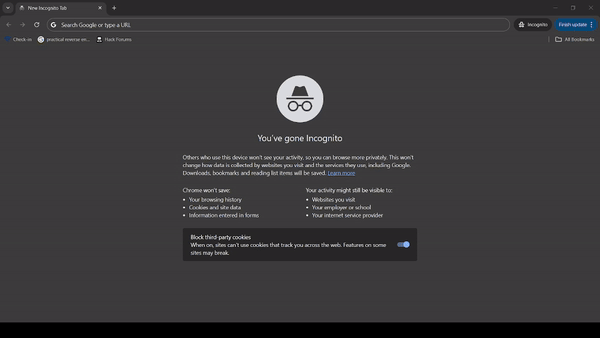

# Population Management App

This project aims to develop a Java application for population management using Docker for containerization and GitHub for version control. The application will provide functionalities to manage population data efficiently.

## Demo



## Table of Contents

- [Demo](#demo)
- [Introduction](#introduction)
- [Features](#features)
- [Technologies Used](#technologies-used)
- [Setup Instructions](#setup-instructions)
- [Usage](#usage)
- [Contributing](#contributing)
- [License](#license)

## Introduction

Population management is crucial for various sectors including urban planning, healthcare, and resource allocation. This application facilitates the management of population data by providing features such as adding population records, updating existing records, and generating statistical reports.

## Features

- **Add Population Records**: Users can add new population records including demographic information.
- **Update Records**: Existing population records can be updated with the latest data.
- **Statistical Reports**: Generate statistical reports based on population data for analysis.
- **Data Visualization**: Visualize population trends through graphical representations.

## Technologies Used

- **Java**: The core programming language for developing the application logic.
- **Docker**: Utilized for containerization, ensuring consistency across different environments.
- **GitHub**: Version control system for collaborative development and code management.

## Setup Instructions

To set up the project locally, follow these steps:

1. Clone the repository from GitHub:

```bash
git clone https://github.com/Drakon4ik-Coder/SET08103_GP.git
```

2.  Open project in IntellijIDE

3. Run Deploy configuration in .run folder

4. Open ```localhost:8080``` in browser of your choice

## Usage

Once the application is set up, users can perform the following actions:

1. Add new population records by providing necessary demographic information.
2. Update existing records with the latest data.
3. Generate statistical reports to analyze population trends.
4. Visualize population data through graphical representations.

## Contributing

Contributions to the project are welcome. To contribute, follow these steps:

1. Fork the repository.
2. Create a new branch (`git checkout -b feature-branch`).
3. Make your changes and commit them (`git commit -am 'Add new feature'`).
4. Push to the branch (`git push origin feature-branch`).
5. Create a new Pull Request.

## License

This project is licensed under the [Apache-2.0 license](LICENSE).

[](https://github.com/Drakon4ik-Coder/SET08103_GP/blob/master/LICENSE)
[](https://github.com/Drakon4ik-Coder/SET08103_GP/releases)
[](https://github.com/Drakon4ik-Coder/SET08103_GP/actions/workflows/main.yml)
